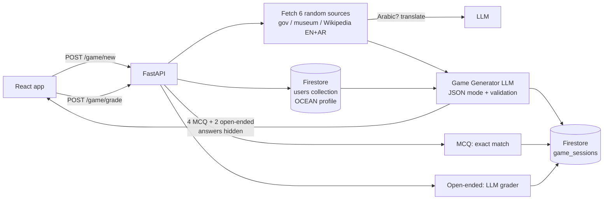

# 🎮 Personality-Shaped Alexandria Trivia Game

A gamification agent for **Alexandria, Egypt**. It builds a fresh trivia game for each visitor. The **facts come from real, trusted websites**, and the **tone, framing and difficulty match the visitor's Big Five (OCEAN) personality**. That profile comes from the [Recommendation](../Recommendation) component.

> This is one component of my graduation project **[Heritage Hub Alexandria](../)**, an agentic AI tourism platform (B.Sc. Artificial Intelligence, AASTMT, 2026).

**Stack:** FastAPI · Groq (`openai/gpt-oss-120b` + fallback chain) · Firebase Firestore · BeautifulSoup · ngrok · Google Colab

---

## ✨ How It Works



1. **Load the profile.** The visitor's OCEAN scores are read from Firestore (saved by the Recommendation quiz).
2. **Ground in real facts.** 6 random pages are fetched from 35 curated sources: the Ministry of Tourism & Antiquities, Bibliotheca Alexandrina, Wikipedia (EN + AR), Rough Guides, Cairo Opera and others. Clean text is extracted, and Arabic pages are translated to English.
3. **Generate the game.** The LLM writes **4 multiple-choice + 2 short open-ended** questions using **only** those snippets, so facts aren't invented.
4. **Validate.** The output is checked for the exact shape (4 options, the answer is one of the options, 4+2 split). If it fails, the model gets the error and retries, up to 3 times.
5. **Hide answers.** Correct answers stay in Firestore and are never sent to the frontend, so they can't be seen in dev tools.
6. **Grade.** MCQs are scored instantly (letter or text accepted). Open-ended answers are graded by the LLM, which is lenient about spelling and phrasing.

### Personality → Game style

| Trait | High → | Low → |
|-------|--------|-------|
| **Openness** | Surprising, lesser-known facts | Well-known, mainstream facts |
| **Conscientiousness** | Precise questions (exact dates, names) | Short, breezy questions |
| **Extraversion** | "Impress your friends" social challenges | Calm, reflective framing |
| **Agreeableness** | Fun facts to share with family | Personal challenges and achievements |
| **Neuroticism** | Low-pressure, reassuring tone, never "wrong!" | Playful, competitive, light teasing |

---

## 🔌 API Endpoints

| Method | Endpoint | Purpose |
|--------|----------|---------|
| `POST` | `/game/new` | Generates a new personality-shaped game for a `user_id` (404 if the user has no profile) |
| `POST` | `/game/grade` | Submits answers → returns per-question results + score |
| `GET` | `/game/history/{user_id}` | Lists past game sessions with scores, newest first |
| `GET` | `/health` | Health check that also shows the active model |

**Example: `POST /game/new`**
```json
// request
{ "user_id": "abc123" }

// response (no correct answers included)
{
  "session_id": "4f1c...",
  "intro": "Ready to impress your friends with some Alexandria secrets?",
  "questions": [
    {"id": 1, "type": "mcq", "question": "...", "options": ["...", "...", "...", "..."]},
    {"id": 5, "type": "open_ended", "question": "..."}
  ]
}
```

**Example: `POST /game/grade`**
```json
// request
{ "session_id": "4f1c...", "answers": [{"id": 1, "answer": "B"}, {"id": 5, "answer": "Qaitbay"}] }

// response
{
  "score": 5, "total": 6,
  "results": [
    {"id": 1, "is_correct": true, "correct_answer": "Citadel of Qaitbay"},
    {"id": 5, "is_correct": true, "feedback": "Exactly right!", "correct_answer": "Qaitbay"}
  ]
}
```

---

## 🗄️ Firestore

| Collection | Written by | Contents |
|------------|-----------|----------|
| `users/{user_id}` | Recommendation component | `ocean_scores`, `ocean_levels` (this notebook only **reads** it) |
| `game_sessions/{session_id}` | This notebook | `user_id`, `questions` (with answers), `score`, `total`, `created_at`, `graded_at` |

---

## 🛡️ Robustness

- **Strong-model selection:** Uses a fixed list of instruction-following models (`gpt-oss-120b` → `llama-3.3-70b` → …). It never picks a small or specialised model just because it's first alphabetically.
- **Automatic fallback:** If a model is rate-limited (429) or errors out, the next model in the chain is tried.
- **JSON mode + schema validation + self-correcting retries:** Invalid games are never shown to the user.
- **Source-fetch retry:** If fewer than 2 pages load, a fresh sample of URLs is tried.
- **No Firestore index needed:** History is filtered in Firestore and sorted in Python.
- **Secrets:** All keys are loaded from Colab Secrets. Nothing is hard-coded.

---

## 🚀 How to Run (Google Colab)

1. Open `Alexandria_Trivia_Game.ipynb` in Google Colab. No GPU is needed.
2. Add 3 secrets in **Colab Secrets 🔑** and turn on notebook access for each:
   - `GROQ_API_KEY`: from [console.groq.com/keys](https://console.groq.com/keys)
   - `NGROK_AUTH_TOKEN`: from [ngrok.com](https://ngrok.com)
   - `FIREBASE_CREDENTIALS_JSON`: the **same** Firebase project as the Recommendation component
3. Run the cells in order. The **"Test the game in-notebook"** cell lets you play directly in Colab. If the test user has no profile yet, it creates a sample one.
4. Run the last cell to get a **public ngrok URL** for the frontend.

---

## 🗂️ Project Structure

```
Heritage-Hub-Alexandria/
└── Gamification/
    ├── Alexandria_Trivia_Game.ipynb   # Profile → web facts → LLM game → grading → FastAPI
    ├── requirements.txt
    └── README.md
```

---

## ⚠️ Limitations & Future Work

- **Live web fetching:** Sources can change, block bots, or go offline, and fetching adds a few seconds to each game. A next step is to cache snippets in Firestore, or to reuse the TourBot vector database as the fact source.
- **Fact accuracy depends on the LLM:** Questions are grounded in snippets, but nothing automatically checks that each answer appears in its source. A verification pass (a second LLM call or string matching) would close that gap.
- **Open-ended grading is subjective:** An LLM grader can be too strict or too lenient.
- **Gamification depth:** Add points, badges, streaks and leaderboards on top of `game_sessions`, and adapt difficulty based on past scores.
- **Deployment:** Colab + ngrok is meant for demos. Move to a persistent host and restrict CORS to the frontend domain.

---

## 🛠️ Tech Stack

Python · FastAPI · Pydantic · Groq · Firebase Admin SDK (Firestore) · Requests · BeautifulSoup · ngrok · Uvicorn · Google Colab

---

## 👤 Author

**Basmala Farouk** — AI Engineer
