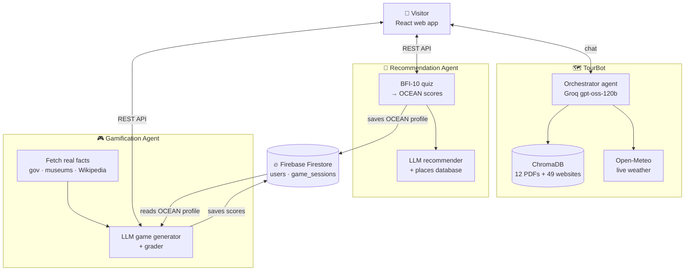

# 🏛️ Heritage Hub Alexandria — Agentic AI Tourism Platform

**Graduation Project · B.Sc. Artificial Intelligence · AASTMT College of Computing & IT, Alexandria · 2026**

Heritage Hub Alexandria is an AI-powered tourism platform that acts as a personal, intelligent guide to **Alexandria, Egypt**. It combines three AI agents in one experience:

- a **chatbot** that answers questions using trusted sources
- a **recommender** that matches places to your personality
- a **trivia game** that teaches the city's heritage in a style suited to you

---

## 🤖 The Three Agents

| | Agent | What it does | Key techniques |
|---|-------|--------------|----------------|
| 🗺️ | **[TourBot](./TourBot)** | Conversational guide: answers questions about attractions, history, food and hotels, plus live weather | Agentic RAG · LangChain tool-calling · ChromaDB · bge-m3 embeddings · 6 tools |
| 🧭 | **[Recommendation Agent](./Recommendation)** | Visitor takes the BFI-10 personality quiz → gets the best place in Alexandria for their personality | Big Five (OCEAN) scoring · LLM reasoning over a places database · FastAPI |
| 🎮 | **[Gamification Agent](./Gamification)** | Generates a fresh trivia game based on real sources, with tone and difficulty shaped by the visitor's personality | Web grounding · JSON-mode generation + validation · LLM grading · FastAPI |

Each folder has its own detailed README, notebook and `requirements.txt`.

---

## 🧠 System Architecture



### How the agents connect

1. A visitor takes the **personality quiz**. The Recommendation Agent computes their **OCEAN profile**, saves it to Firestore and suggests a place that fits them.
2. The **Gamification Agent** reads the same profile to shape its trivia. For example, curious visitors get lesser-known facts, and anxious visitors get a gentle, low-pressure tone.
3. **TourBot** is always available to answer any question about the city, using official sources.

**Shared personality profile → personalised experience across agents.**

---

## ✨ Highlights

- **Grounded, not invented:** Answers and trivia come from official and curated sources (Ministry of Tourism & Antiquities, Bibliotheca Alexandrina, Wikipedia, travel guides), with anti-hallucination prompting.
- **Psychology-based personalisation:** Uses the validated BFI-10 instrument (Rammstedt & John, 2007) instead of ad-hoc preference questions.
- **Agentic design:** TourBot chooses between 6 tools on its own, asks a clarifying question when needed, and keeps context across turns.
- **Production-minded APIs:** FastAPI endpoints, input validation, hidden answer keys, model fallback on rate limits, and secrets kept out of the code.
- **Tested:** TourBot has an 11-case test suite, and the Recommendation and Gamification APIs are tested in-process with FastAPI `TestClient`.

---

## 🗂️ Repository Structure

```
Heritage-Hub-Alexandria/
├── README.md                      ← you are here
├── TourBot/
│   ├── Chatbot_Graduation_project.ipynb
│   ├── tourbot_vectordb_backup.zip
│   ├── requirements.txt
│   └── README.md
├── Recommendation/
│   ├── Recommendation_Agent.ipynb
│   ├── alexandria_places.json
│   ├── requirements.txt
│   └── README.md
└── Gamification/
    ├── Alexandria_Trivia_Game.ipynb
    ├── requirements.txt
    └── README.md
```

---

## 🚀 Getting Started

All three agents run in **Google Colab**. Open the notebook in each folder and follow its README.

**Secrets** (Colab → 🔑 Secrets):

| Secret | TourBot | Recommendation | Gamification |
|--------|:------:|:------:|:------:|
| `GROQ_API_KEY` ([get one free](https://console.groq.com/keys)) | ✅ | ✅ | ✅ |
| `NGROK_AUTH_TOKEN` ([ngrok.com](https://ngrok.com)) | optional | ✅ | ✅ |
| `FIREBASE_CREDENTIALS_JSON` (service account) | — | ✅ | ✅ same project |

**Suggested order:** run **Recommendation** first, so a personality profile exists in Firestore. Then run **Gamification**, which reads that profile. **TourBot** runs on its own.

---

## 🛠️ Tech Stack

| Area | Tools |
|------|-------|
| **LLMs** | Groq API (`openai/gpt-oss-120b`, `llama-3.3-70b-versatile`) |
| **Agents & RAG** | LangChain · ChromaDB · Sentence-Transformers (`BAAI/bge-m3`) |
| **Backend** | FastAPI · Pydantic · Uvicorn · ngrok |
| **Database** | Firebase Firestore |
| **Data collection** | Trafilatura · BeautifulSoup · PyPDF · Open-Meteo API |
| **Environment** | Python · Google Colab |

---

## ⚠️ Limitations & Future Work

- **Deployment:** The agents run on Colab + ngrok for demos. Next steps are hosting them on a persistent platform (e.g. Cloud Run) behind a single API gateway.
- **Single orchestrator:** A top-level router agent (e.g. LangGraph) could send each visitor request to the right agent automatically.
- **Shared knowledge:** The Gamification Agent could reuse TourBot's vector database instead of fetching websites live.
- **Evaluation:** Add RAGAS metrics for TourBot and labeled test sets for recommendation quality.
- **Arabic support:** Full Arabic conversations for local visitors.

Each agent's README lists its own specific limitations.

---

## 👤 Author

**Basmala Farouk** — AI Engineer
B.Sc. Artificial Intelligence, AASTMT (2026)
# Heritage-Hub-Alexandria
Graduation Project
