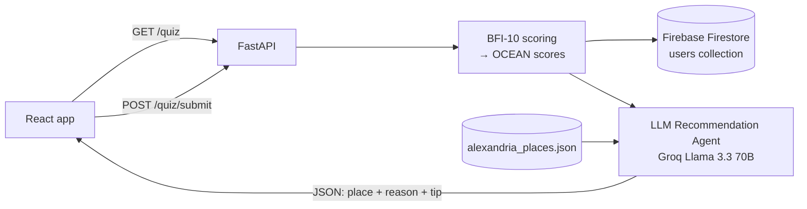

# 🧭 Personality-Based Recommendation Agent

A personality-aware recommender for **Alexandria, Egypt**. Visitors take a short scientific personality quiz (BFI-10), the system computes their **Big Five (OCEAN)** traits, and an LLM agent picks the **single best place in Alexandria** for that personality, explaining why it fits.

> This is one component of my graduation project **[Heritage Hub Alexandria](../)**, an agentic AI tourism platform (B.Sc. Artificial Intelligence, AASTMT, 2026).

**Stack:** FastAPI · Groq (`llama-3.3-70b-versatile`) · Firebase Firestore · ngrok · Google Colab

---

## ✨ How It Works



1. **Quiz:** The visitor answers the 10 BFI-10 statements on a 1–5 scale.
2. **Scoring:** Each trait is the average of 2 items, with reverse-keyed items flipped (`6 − score`). Each score is then labeled **Low** (< 2.5), **Medium** (2.5–3.4), or **High** (≥ 3.5).
3. **Storage:** The profile is saved to Firestore along with the raw answers and a full **quiz history** for retakes.
4. **Recommendation:** The LLM receives the OCEAN profile plus a compressed places database and returns **one place** as structured JSON.

### Personality → Place mapping (encoded in the agent's prompt)

| Trait | High → | Low → |
|-------|--------|-------|
| **Openness** | Museums, history, art, hidden gems | Popular mainstream spots |
| **Conscientiousness** | Structured tours, landmark museums | Spontaneous markets, street food |
| **Extraversion** | Lively beaches, busy restaurants, malls | Quiet cafés, calm parks |
| **Agreeableness** | Family-friendly, group dining | Independent solo experiences |
| **Neuroticism** | Calm, low-crowd places only | Any environment, crowds included |

---

## 🔌 API Endpoints

| Method | Endpoint | Purpose |
|--------|----------|---------|
| `GET` | `/quiz` | Returns the 10 questions and the answer scale for the frontend |
| `POST` | `/quiz/submit` | Submits answers → computes and saves OCEAN scores → returns a recommendation |
| `GET` | `/profile/{user_id}` | Fetches a saved OCEAN profile (404 if none exists) |
| `POST` | `/recommend/{user_id}` | Gets a fresh recommendation from the saved profile, without retaking the quiz |
| `GET` | `/health` | Health check that also shows the active model |

**Example: `POST /quiz/submit`**
```json
// request
{ "user_id": "abc123", "answers": {"1": 2, "2": 4, "3": 1, "4": 4, "5": 2, "6": 5, "7": 2, "8": 5, "9": 2, "10": 5} }

// response
{
  "ocean_scores": {"openness": 4.5, "conscientiousness": 5.0, "extraversion": 4.5, "agreeableness": 4.0, "neuroticism": 2.0},
  "ocean_levels": {"openness": "High", "conscientiousness": "High", "extraversion": "High", "agreeableness": "High", "neuroticism": "Low"},
  "recommendation": {
    "introduction": "...",
    "recommendation": {
      "name": "Bibliotheca Alexandrina",
      "category": "attraction",
      "reason": "...",
      "tip": "Visit in the morning or late afternoon to avoid crowds."
    },
    "closing_tip": "..."
  }
}
```

---

## 🗄️ Data

### Places database: `alexandria_places.json`
A curated set of Alexandria places. Each place is described by personality-relevant attributes:

```json
{
  "name": "Montaza Palace Gardens",
  "category": "attraction",
  "atmosphere": "quiet, green, royal",
  "crowd_level": "low",
  "price_range": "low",
  "ideal_for": "introverts, families, nature lovers",
  "description": "Expansive royal gardens with quiet walking paths and sea views..."
}
```
Categories include attractions, restaurants, cafés, beaches, malls, markets, and hidden gems.

### Firestore schema: `users/{user_id}`
```
ocean_scores   → {openness, conscientiousness, extraversion, agreeableness, neuroticism}
ocean_levels   → {trait: "Low" | "Medium" | "High"}
raw_answers    → original BFI-10 answers (allows re-scoring later)
quiz_history   → [{ocean_scores, taken_at}, ...]   # appended on every retake
created_at / updated_at
```
The **Gamification** component reads this profile to personalize its questions.

---

## 🛡️ Robustness

- **Model auto-selection:** Lists the Groq models available on the account and picks the best one from a preferred list.
- **Rate-limit fallback:** If the selected model returns a 429 error, it retries with another available model.
- **JSON parsing:** Strips Markdown code fences from LLM output before parsing and falls back to raw text if parsing fails.
- **Input validation:** Returns 400 for incomplete answers and 404 for unknown users.
- **Secrets:** All keys are loaded from Colab Secrets. Nothing is hard-coded.

---

## 🧪 Testing

Before exposing the API, the notebook tests it in-process with FastAPI's `TestClient`:

| # | Test | Result |
|---|------|--------|
| 1 | `GET /quiz` returns 10 questions | ✅ |
| 2 | `POST /quiz/submit` → scoring + Firestore write + Groq recommendation | ✅ |
| 3 | `GET /profile/{id}` reads the saved profile back | ✅ |
| 4 | `POST /recommend/{id}` re-recommends from the saved profile | ✅ |
| 5 | Incomplete answers → 400 | ✅ |
| 6 | Unknown user → 404 | ✅ |

The notebook also includes an **interactive quiz** you can take directly inside the notebook.

---

## 🚀 How to Run (Google Colab)

1. Open `Recommendation_Agent.ipynb` in Google Colab.
2. Add 3 secrets in **Colab Secrets 🔑** and turn on notebook access for each:
   - `GROQ_API_KEY`: from [console.groq.com/keys](https://console.groq.com/keys)
   - `NGROK_AUTH_TOKEN`: from [ngrok.com](https://ngrok.com) (free)
   - `FIREBASE_CREDENTIALS_JSON`: the full contents of your Firebase service account JSON (Firebase Console → Project Settings → Service Accounts → Generate new private key)
3. Upload `alexandria_places.json` to `/content/`.
4. Run all cells. The test cell checks everything end-to-end.
5. The last server cell prints a **public ngrok URL**. Give that URL to the frontend.

---

## 🗂️ Project Structure

```
Heritage-Hub-Alexandria/
└── Recommendation/
    ├── Recommendation_Agent.ipynb   # Quiz → scoring → Firestore → LLM → FastAPI
    ├── alexandria_places.json       # Places database with personality attributes
    ├── requirements.txt
    └── README.md
```

---

## ⚠️ Limitations & Future Work

- **Popularity bias:** Different personality profiles were often matched to the same famous place (Bibliotheca Alexandrina). A next step is a **hybrid approach**: score places against the OCEAN profile with deterministic rules first, then let the LLM pick from the top 3 and write the explanation.
- **Single recommendation:** Return a ranked top 3 so users get alternatives.
- **Short instrument:** BFI-10 trades accuracy for speed. A longer inventory (e.g. BFI-44) would give more reliable trait scores.
- **No evaluation set yet:** Add a set of labeled personality-to-place cases to measure recommendation quality and consistency.
- **Deployment:** Colab + ngrok is meant for demos. Move to a persistent host (Cloud Run, Render, Railway) and restrict CORS to the frontend domain.

---

## 📚 Reference

Rammstedt, B., & John, O. P. (2007). *Measuring personality in one minute or less: A 10-item short version of the Big Five Inventory in English and German.* Journal of Research in Personality, 41(1), 203–212.

---

## 🛠️ Tech Stack

Python · FastAPI · Pydantic · Groq · Firebase Admin SDK (Firestore) · ngrok · Uvicorn · Google Colab

---

## 👤 Author

**Basmala Farouk** — AI Engineer
