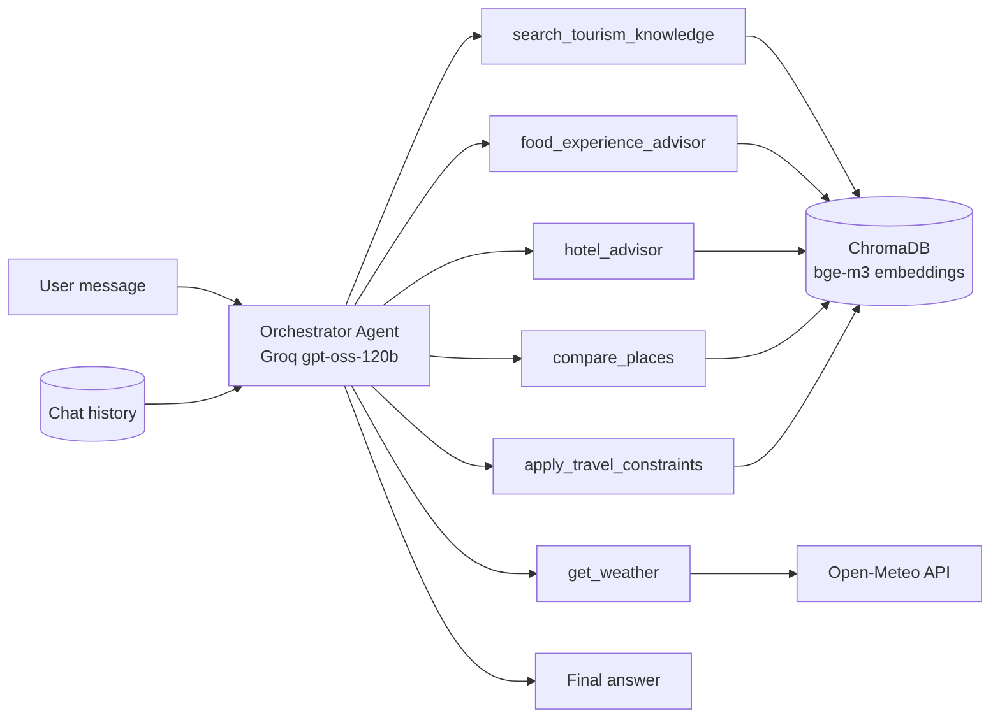

# 🏛️ TourBot — Alexandria Multi-Agent Tourism Chatbot

An agentic RAG chatbot that acts as a local guide for **Alexandria, Egypt**. It answers questions about attractions, history, food, hotels, and live weather, and adapts its recommendations to the type of traveler.

> This is one component of my graduation project **[Heritage Hub Alexandria](../)**, an agentic AI tourism platform (B.Sc. Artificial Intelligence, AASTMT, 2026).

**Stack:** LangChain tool-calling agent · Groq (`openai/gpt-oss-120b`) · BAAI/bge-m3 embeddings (local) · ChromaDB · Open-Meteo API

---

## ✨ Features

One orchestrator agent decides which tool(s) to call for each message:

| Tool | What it does |
|------|--------------|
| 📚 `search_tourism_knowledge` | RAG search over official Alexandria sources: places, history, museums, activities |
| 🌤️ `get_weather` | Live weather for any Egyptian city via Open-Meteo (no API key needed) |
| 🍽️ `food_experience_advisor` | Restaurant recommendations; asks for cuisine and budget first if they're missing |
| 🏨 `hotel_advisor` | Hotel recommendations, grounded only in retrieved data |
| ⚖️ `compare_places` | Side-by-side Markdown comparison table (History / Time Needed / Price / Best For) |
| 🎯 `apply_travel_constraints` | Adapts suggestions for families with kids, solo, budget, couples, or elderly travelers |

**Also included:**
- Multi-turn memory per session (resolves references like "there" or "it")
- Clarification flow: asks one question instead of guessing
- Anti-hallucination prompting: never invents restaurant or hotel names, never leaks sources or URLs
- Off-topic handling: politely declines non-Alexandria requests
- Retry logic and graceful handling of rate limits
- Interactive chat UI inside the notebook (ipywidgets)

---

## 🧠 Architecture



---

## 📂 Knowledge Base

Only official, named sources about **Alexandria** are used, to reduce the risk of hallucination:

- **12 PDFs:** tourism studies, archaeological site reports, travel guides, and restaurant menus
- **49 websites:** Egyptian Ministry of Tourism & Antiquities (`egymonuments.gov.eg`), Bibliotheca Alexandrina, Wikipedia (EN/AR), Rough Guides, and official hotel and restaurant pages (Four Seasons, Steigenberger, Helnan, Crowne Plaza, Tolip, and others)

**Pipeline:** load → split (1,000-character chunks, 100 overlap) → embed with `BAAI/bge-m3` → store in ChromaDB → retrieve the top 4 chunks per query.

The vector store is built **once** and saved to disk, so later sessions load it instantly with no re-embedding. A ready-made backup is included as `tourbot_vectordb_backup.zip`.

---

## 🧪 Test Suite

The notebook includes 11 tests covering the main capabilities:

| # | Test | Result |
|---|------|--------|
| 1 | Basic RAG retrieval (Qaitbay Citadel) | ✅ |
| 2 | Live weather API call | ✅ |
| 3 | Multi-turn clarification (asks cuisine + budget, then recommends) | ✅ |
| 4 | Anti-hallucination with uncovered cuisine (sushi) | ⚠️ Didn't invent a name, but didn't clearly say "no data" |
| 5 | No source/URL leakage | ✅ |
| 6 | Markdown comparison table | ✅ |
| 7 | Traveler-type adaptation (family vs. solo budget) | ✅ |
| 8 | Multi-tool reasoning (weather + recommendation) | ✅ |
| 9 | Greeting & off-topic handling | ✅ |
| 10 | Context retention across turns | ✅ |
| 11 | Edge-case inputs (`???`, gibberish) | ✅ |

### Example conversation

> **User:** Qaitbay Citadel or Montaza Palace — which should I visit?
>
> **TourBot:**
> | | Qaitbay Citadel | Montaza Palace |
> |---|---|---|
> | History | 15th-century Mamluk fortress on the site of the ancient Lighthouse | Late 19th-century royal summer residence |
> | Time Needed | 1–2 hours | 2–3 hours |
> | Best For | History buffs, coastal views | Families, gardens, relaxed strolling |
>
> Go for Qaitbay for maritime history, or Montaza for a leisurely day with gardens and sea breezes.

---

## 🚀 How to Run (Google Colab)

1. Open `Chatbot_Graduation_project.ipynb` in Google Colab (a T4 GPU speeds up embedding).
2. Add your key to **Colab Secrets 🔑**:
   - `GROQ_API_KEY`: free at [console.groq.com](https://console.groq.com)
   - `NGROK_TOKEN`: optional, only needed if you expose the bot as an API
3. Run the install cell, then **restart the session** (Runtime → Restart Session).
4. **Fast option:** upload `tourbot_vectordb_backup.zip` to `/content/` and run the unzip cell. The vector store loads instantly.
   **Rebuild option:** upload the PDFs to `/content/tourism_docs/` and the notebook will embed everything once.
5. Run the remaining cells, then chat using the UI or run the test suite.

---

## 🗂️ Project Structure

```
Heritage-Hub-Alexandria/
└── TourBot/
    ├── Chatbot_Graduation_project.ipynb   # Full pipeline: data → RAG → agent → UI → tests
    ├── tourbot_vectordb_backup.zip        # Prebuilt ChromaDB vector store
    ├── requirements.txt
    └── README.md
```

---

## ⚠️ Limitations & Future Work

- **Coverage gaps:** Restaurant and hotel data is limited to the collected sources. When the data is thin, the bot can still lean on general model knowledge.
- **Climate questions:** Questions like "weather in October" are answered from general knowledge, because the weather tool only returns current conditions. A future version could add a forecast or climate tool.
- **Single orchestrator:** All tools sit on one agent. A LangGraph multi-agent setup could add specialist agents with their own memory.
- **Evaluation:** The tests are qualitative. Next steps are RAGAS metrics (faithfulness, answer relevancy) and a labeled question set.
- **Deployment:** Wrap the agent in a FastAPI endpoint for the Heritage Hub frontend.

---

## 🛠️ Tech Stack

Python · LangChain · Groq · Sentence-Transformers (bge-m3) · ChromaDB · Trafilatura · Geopy · Open-Meteo · ipywidgets · Google Colab

---

## 👤 Author

**Basmala Farouk** — AI Engineer
